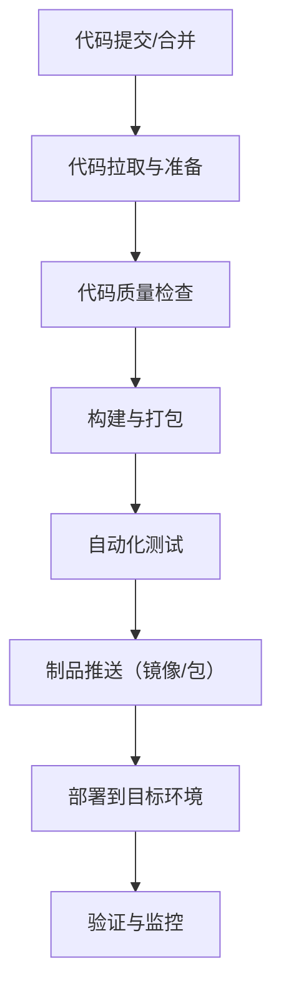

### 一、先搞懂核心概念（避免混淆）
- **CI（持续集成）**：开发人员频繁将代码合并到主干，每次合并后自动执行「编译、测试、代码检查」，快速发现问题，核心目标是**减少集成风险**；
- **CD（持续交付/持续部署）**：
  - 持续交付：CI通过后，自动将代码打包成可部署的制品（如Docker镜像），手动触发部署到测试/生产环境；
  - 持续部署：交付环节完全自动化，制品直接部署到生产环境（适合互联网高频迭代场景）；
- 流水线核心：**代码变更→自动触发→多阶段验证→自动部署**，全程无需人工干预（或仅少量人工审批）。

### 二、CI/CD流水线通用流程（分7个核心阶段）
不管用Jenkins、GitLab CI、GitHub Actions还是阿里云效，流水线的核心阶段都一致，以下是最完整的通用流程（按执行顺序）：



#### 阶段1：代码提交/合并（触发点）
- 触发条件：开发人员将代码`git push`到仓库（如GitLab/GitHub），或合并PR/MR到主干分支（如main/dev）；
- 关键配置：可设置“仅指定分支（如main）触发”“跳过CI的提交（加[skip ci]注释）”，避免无效触发。

#### 阶段2：代码拉取与准备（环境初始化）
- 核心操作：流水线代理节点拉取最新代码，初始化构建环境（如安装依赖、配置镜像源）；
- 示例（GitLab CI）：
  ```yaml
  stages:
    - prepare
  prepare_job:
    stage: prepare
    script:
      - git checkout $CI_COMMIT_BRANCH  # 拉取当前分支代码
      - pip install -r requirements.txt  # 安装Python依赖
      - docker login -u $USER -p $PASS $REGISTRY  # 登录镜像仓库
  ```

#### 阶段3：代码质量检查（提前发现问题）
- 核心操作：执行代码规范、安全扫描，避免低质量代码进入后续环节；
- 常用工具：
  - 代码规范：ESLint（前端）、Pylint（Python）、SonarQube（多语言）；
  - 安全扫描：SAST（静态扫描，如GitLab SAST）、Dependency-Check（依赖漏洞）；
- 关键：设置“检查不通过则终止流水线”，比如代码覆盖率低于80%直接失败。

#### 阶段4：构建与打包（生成可运行制品）
- 核心操作：将代码编译/打包成可部署的制品，不同语言/场景制品类型不同；
  | 场景         | 制品类型               | 常用工具               |
  |--------------|------------------------|------------------------|
  | 前端项目     | 静态资源包（dist）     | npm run build          |
  | 后端项目     | JAR/WAR包              | Maven/Gradle           |
  | 容器化部署   | Docker镜像             | docker build           |
- 示例（构建Docker镜像）：
  ```bash
  docker build -t $REGISTRY/my-app:$CI_COMMIT_SHA .  # 用提交哈希做镜像标签，避免重复
  ```

#### 阶段5：自动化测试（验证功能正确性）
- 核心操作：执行多维度测试，确保制品功能正常，测试不通过则终止流水线；
  | 测试类型       | 作用                     | 常用工具               |
  |----------------|--------------------------|------------------------|
  | 单元测试       | 测试单个函数/模块        | JUnit（Java）、pytest（Python） |
  | 接口测试       | 测试API接口             | Postman/Newman、JMeter |
  | 集成测试       | 测试模块间交互           | TestNG、pytest        |
- 关键：测试结果生成报告（如JUnit格式），便于排查问题。

#### 阶段6：制品推送（存储与版本管理）
- 核心操作：将构建好的制品推送到仓库，便于后续部署；
  | 制品类型   | 仓库类型               | 示例命令                     |
  |------------|------------------------|------------------------------|
  | Docker镜像 | 镜像仓库（Harbor/阿里云） | docker push $REGISTRY/my-app:$TAG |
  | 软件包     | 包仓库（Nexus/PyPI）| mvn deploy                  |
- 关键：制品打唯一标签（如提交哈希、版本号），避免覆盖，便于回滚。

#### 阶段7：部署到目标环境（核心交付环节）
- 核心操作：将制品部署到对应环境，按“测试→预发→生产”逐步推进，生产环境可加人工审批；
  | 环境       | 部署方式               | 适用工具               |
  |------------|------------------------|------------------------|
  | 测试环境   | 自动部署               | Jenkins、GitLab CI     |
  | 生产环境   | 人工审批后部署         | GitLab CI/CD 审批、ArgoCD |
- 示例（部署到K8s）：
  ```bash
  # 替换K8s部署文件中的镜像标签
  sed -i "s|IMAGE_TAG|$CI_COMMIT_SHA|g" deploy.yaml
  # 部署到K8s集群
  kubectl apply -f deploy.yaml -n test
  ```

#### 阶段8：验证与监控（收尾+兜底）
- 核心操作：部署后验证应用是否正常运行，同时监控运行状态；
  - 验证：检查应用端口是否通、接口返回是否正常（`curl http://$IP/health`）；
  - 监控：接入Prometheus/Grafana，监控CPU/内存/接口响应时间，异常则告警；
- 回滚机制：验证失败时，自动回滚到上一个稳定版本（如`kubectl rollout undo deployment/my-app`）。

### 三、主流CI/CD工具对比（选工具参考）
| 工具         | 优势                     | 适用场景               |
|--------------|--------------------------|------------------------|
| Jenkins      | 插件丰富、高度自定义     | 复杂场景、多工具集成   |
| GitLab CI/CD | 与GitLab深度集成、无需额外部署 | 已用GitLab的团队       |
| GitHub Actions | 与GitHub集成、配置简单    | 开源项目、GitHub仓库   |
| 阿里云效/华为云DevOps | 云原生、开箱即用         | 国内云厂商用户         |

### 四、实战示例（GitLab CI/CD完整流水线配置）
以下是一个Python应用+Docker+K8s的完整`.gitlab-ci.yml`配置，覆盖核心流程：
```yaml
# 定义流水线阶段
stages:
  - prepare
  - lint
  - build
  - test
  - deploy

# 全局变量
variables:
  REGISTRY: harbor.example.com
  APP_NAME: my-python-app
  TAG: $CI_COMMIT_SHORT_SHA  # 用短提交哈希做标签

# 阶段1：环境准备
prepare:
  stage: prepare
  script:
    - pip install -r requirements.txt
    - docker login -u $HARBOR_USER -p $HARBOR_PASS $REGISTRY

# 阶段2：代码检查
lint:
  stage: lint
  script:
    - pylint ./src --fail-under=8.0  # 代码评分低于8分则失败
    - dependency-check --scan ./src --format HTML --out dependency-report.html

# 阶段3：构建镜像
build:
  stage: build
  script:
    - docker build -t $REGISTRY/$APP_NAME:$TAG .
    - docker push $REGISTRY/$APP_NAME:$TAG

# 阶段4：单元测试
test:
  stage: test
  script:
    - pytest ./tests/ --junitxml=test-report.xml
  artifacts:
    reports:
      junit: test-report.xml  # 上传测试报告

# 阶段5：部署到测试环境
deploy:
  stage: deploy
  only:
    - main  # 仅main分支触发部署
  script:
    - sed -i "s|{{IMAGE_TAG}}|$TAG|g" k8s/deploy.yaml
    - kubectl apply -f k8s/deploy.yaml -n test
    - sleep 10
    - kubectl rollout status deployment/$APP_NAME -n test  # 验证部署状态
```

### 总结
1. CI/CD流水线核心是**“自动化替代人工”**，核心流程为：代码提交→环境准备→代码检查→构建打包→测试→制品推送→部署→验证；
2. 关键控制点：分支触发规则、质量门禁（检查不通过终止）、制品版本唯一、部署后验证+回滚机制；
3. 工具选择：中小团队优先用GitLab CI/GitHub Actions（与代码仓库集成），复杂场景用Jenkins。


完整口述流程（带工具 + 步骤）
我理解的 CI/CD 自动化流水线，一共分为 8 个阶段，每个阶段都有对应的工具，全程自动化：

代码提交与触发
开发人员写完代码，通过 Git 提交到代码仓库，比如 GitLab、GitHub、Gitee。
只要代码一合并或推送，就会自动触发流水线，不需要人工操作。

拉取代码与环境准备
流水线开始后，会通过 Git 自动拉取最新代码。
然后在构建机上准备环境，比如安装 JDK、Node.js、Maven、Python 等依赖，
这一步一般用 Jenkins、GitLab CI、GitHub Actions 来调度执行。

代码质量与安全扫描
代码拉下来后，先做质量检查：

用 SonarQube 做代码规范、bug、坏味道检测
用 依赖检查工具 扫描第三方包漏洞
不通过的话，流水线直接终止，不让问题进入下一步。
编译构建与打包
检查通过后开始构建：

Java 项目用 Maven / Gradle 打成 Jar 包
前端用 npm / yarn 构建出 dist 静态包
然后用 Docker 构建成镜像，生成可直接运行的容器镜像。
自动化测试
构建完成后自动跑测试：

单元测试用 JUnit、Pytest
接口测试用 Postman、JMeter
测试不通过，流水线失败，保证上线质量。
制品上传（仓库存储）
测试通过后，把 Docker 镜像推送到镜像仓库：

常用 Harbor、阿里云镜像仓库、Docker Hub
每个镜像都带唯一版本号，方便回滚。
自动部署发布
部署一般分环境：测试环境 → 预发 → 生产。

部署工具用 Jenkins、GitLab CI、ArgoCD
如果是 K8s 环境，就用 kubectl 执行部署文件
生产环境一般会加人工审批，确认无误再发布。
部署验证与回滚
部署完成后，自动检查服务是否正常启动、接口是否可用。
如果有问题，自动回滚到上一个稳定版本，保证业务不中断。
同时用 Prometheus + Grafana 监控服务运行状态。

最后总结一句（面试官超爱）
整个 CI/CD 流水线，从代码提交到构建、测试、部署、监控全部自动化，用 Git、Jenkins、Docker、K8s、Sonar、Harbor 这些工具配合，大大提高发布效率，减少人为失误，保证线上稳定