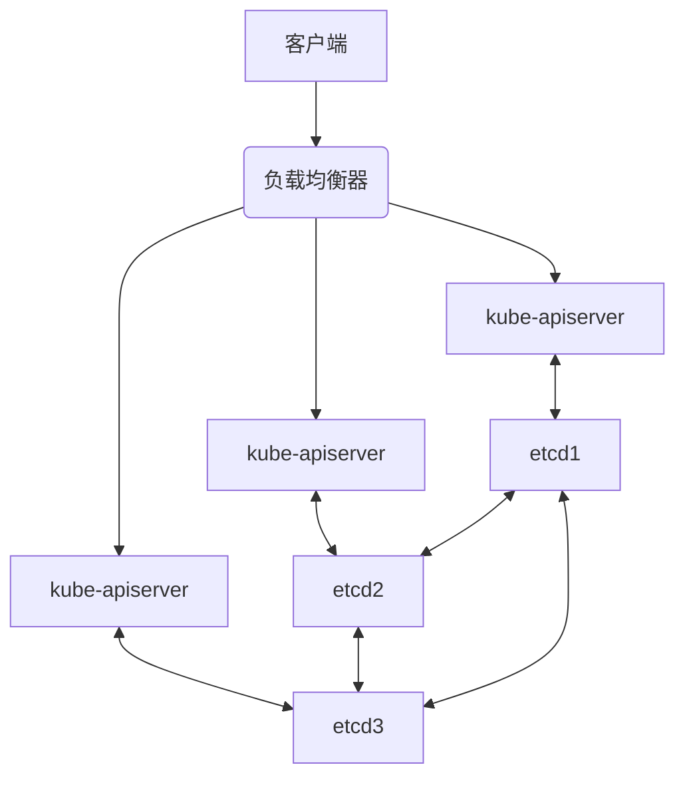

K8S 的高可用是“分层保障”的思路，从**集群层面**到**应用层面**都有对应的解决方案，下面我会从核心组件到应用部署，一步步讲清楚。

## 一、先明确：高可用要解决什么问题？
- 控制平面（Master 节点）宕机，集群依然能管理
- 工作节点（Node 节点）挂了，应用能自动迁移
- 单个 Pod 挂了，能自动重建
- 服务访问不中断，请求能正常转发

## 二、K8S 集群层面的高可用（核心基石）
### 1. 控制平面（Master）多副本部署
控制平面是 K8S 的“大脑”，包含 `kube-apiserver`、`etcd`、`kube-scheduler`、`kube-controller-manager` 核心组件，高可用的核心是**不搞单 Master 节点**：
- **kube-apiserver**：部署多个实例（每个 Master 节点一个），前端通过负载均衡器（如 Nginx/HAProxy/云厂商 LB）做请求分发，单个 apiserver 挂了不影响集群访问。
- **etcd**：集群的“数据库”，必须部署**奇数个副本**（3/5/7 个），通过 Raft 共识算法保证数据一致性，单个 etcd 节点宕机，集群数据不丢、能正常读写。
- **kube-scheduler/kube-controller-manager**：通过**领导者选举（Leader Election）** 机制，同一时间只有一个主实例工作，其他为备用；主实例宕机后，备用实例会自动接管，无感知切换。



### 2. 工作节点（Node）多副本 + 故障自动迁移
- 工作节点部署多个，应用的 Pod 分散在不同 Node 上，单个 Node 宕机，只会影响该节点上的 Pod，其他 Node 上的 Pod 正常运行。
- K8S 的 `kubelet` 和 `kube-proxy` 组件运行在每个 Node 上，实时向控制平面上报节点状态，控制平面发现节点故障后，会触发 **Pod 重调度**。

## 三、应用层面的高可用（核心落地手段）
集群层面的高可用是基础，应用的高可用需要你通过 K8S 资源配置来实现，这也是日常使用中最常操作的部分：

### 1. Deployment/StatefulSet：Pod 自动重建 + 多副本
这是最核心的应用部署方式，替代了直接创建 Pod（单 Pod 无高可用）：
- **多副本（replicas）**：配置多个 Pod 副本，分散在不同 Node 上，单个 Pod 挂了，其他 Pod 依然能提供服务。
- **自愈能力**：K8S 会持续监控 Pod 状态，若 Pod 因进程崩溃、节点宕机等原因终止，`kube-controller-manager` 会自动在健康节点上重建新的 Pod。

**核心配置示例**：
```yaml
apiVersion: apps/v1
kind: Deployment
metadata:
  name: my-app
spec:
  replicas: 3  # 部署3个Pod副本，保证高可用
  selector:
    matchLabels:
      app: my-app
  template:
    metadata:
      labels:
        app: my-app
    spec:
      containers:
      - name: my-app
        image: my-app:v1
        ports:
        - containerPort: 8080
        # 健康检查：提前发现Pod异常，自动重启
        livenessProbe:  # 存活探针：检测Pod是否存活，挂了就重启
          httpGet:
            path: /health
            port: 8080
          initialDelaySeconds: 30  # 启动30秒后开始检测
          periodSeconds: 10        # 每10秒检测一次
        readinessProbe:  # 就绪探针：检测Pod是否能接收请求，未就绪则剔除流量
          httpGet:
            path: /ready
            port: 8080
          initialDelaySeconds: 5
          periodSeconds: 5
```

### 2. Service：稳定的访问入口 + 负载均衡
Pod 会重建、IP 会变化，Service 就是为 Pod 提供**固定的访问地址**，同时实现 Pod 间的负载均衡：
- **ClusterIP**：集群内部访问，自动把请求分发到多个 Pod 副本。
- **NodePort/LoadBalancer**：外部访问，通过节点端口或云厂商 LB 暴露服务，单个 Node 挂了，其他 Node 仍能接收请求。

**核心配置示例**：
```yaml
apiVersion: v1
kind: Service
metadata:
  name: my-app-service
spec:
  selector:
    app: my-app  # 关联上面Deployment的Pod标签
  ports:
  - port: 80        # Service的端口
    targetPort: 8080 # Pod的端口
  type: ClusterIP   # 集群内访问，外部访问可换NodePort/LoadBalancer
```

### 3. 健康检查（探针）：提前发现并处理异常
上面 Deployment 配置中的 `livenessProbe`（存活探针）和 `readinessProbe`（就绪探针）是高可用的关键：
- **存活探针**：检测 Pod 内容器是否正常运行，若失败，K8S 会重启容器。
- **就绪探针**：检测 Pod 是否能正常处理请求，若失败，Service 会把该 Pod 从负载均衡列表中剔除，直到恢复正常。
- 可选：`startupProbe`（启动探针），适合启动慢的应用（如Java应用），避免启动过程中被误判为故障。

### 4. 其他高可用保障
- **Pod 反亲和性**：确保同一应用的多个 Pod 不会部署在同一个 Node 上，避免 Node 宕机导致应用全部不可用。
- **StatefulSet**：针对有状态应用（如数据库、Redis集群），提供稳定的网络标识和持久化存储，保证副本有序启动/停止。
- **PersistentVolume (PV)**：持久化存储，Pod 重建后数据不丢失。
- **Horizontal Pod Autoscaler (HPA)**：根据负载自动扩缩容 Pod 数量，应对流量峰值。

## 三、配置生效与验证
1. 部署 Deployment 和 Service：
```bash
kubectl apply -f my-app-deployment.yaml
kubectl apply -f my-app-service.yaml
```
2. 查看 Pod 状态（确认多副本运行）：
```bash
kubectl get pods -l app=my-app
```
3. 模拟 Pod 故障（验证自动重建）：
```bash
kubectl delete pod <pod-name>
# 再次查看，会发现新的Pod被创建
kubectl get pods -l app=my-app
```
4. 模拟 Node 故障（验证 Pod 迁移）：
```bash
# 标记Node不可调度
kubectl cordon <node-name>
# 驱逐Node上的Pod
kubectl drain <node-name> --ignore-daemonsets
# 查看Pod，会发现Pod迁移到其他Node
kubectl get pods -o wide -l app=my-app
```

---

### 总结
1. K8S 集群高可用核心是**控制平面多副本 + etcd 集群 + 领导者选举**，避免单点故障；
2. 应用高可用核心是**Deployment 多副本 + Service 负载均衡 + 健康检查**，保证 Pod 故障自动恢复、请求不中断；
3. 进阶保障可通过**反亲和性、StatefulSet、HPA、持久化存储**进一步提升稳定性。

---

我给你用**最直白、面试能直接说出口**的方式讲清楚：**什么是 etcd 集群、为什么要用、怎么工作、为什么必须奇数节点**。

---

# 一、etcd 是什么？
一句话：
**etcd 是 Kubernetes 的“数据库 / 配置中心”，是一个分布式、强一致、高可用的键值存储。**

- K8s 所有数据都存在 etcd：
  - 节点信息
  - Pod、Deployment、Service 配置
  -  Secrets、ConfigMap
  - 集群状态
- 它是 K8s **唯一的真实数据源**。

---

# 二、什么是 etcd 集群？
就是：
**把多个 etcd 节点组成一个集群，一起存数据，保证：**
- 数据不丢
- 服务不挂
- 所有节点看到的数据完全一致

这就叫 **etcd 集群**。

---

# 三、etcd 集群靠什么保证高可用？
核心两点：

### 1. Raft 一致性算法
- 所有节点数据**完全一致**
- 同一时间只有一个 **Leader** 负责写
- Follower 只负责同步数据
- Leader 挂了 → 自动选举新 Leader

### 2. 容错机制（重点！面试必考）
etcd 集群必须用 **奇数节点**：
- 3 节点：最多允许挂 **1 个**
- 5 节点：最多允许挂 **2 个**
- 7 节点：最多允许挂 **3 个**

只要 **存活节点 > 一半**，集群就能正常工作。

> 为什么不能 2 节点？
> 因为 2 节点挂 1 个就剩 50%，不满足“大于一半”，集群直接不可用。

---

# 四、etcd 集群工作流程（极简口述版）
1. 客户端写数据 → 发给 Leader
2. Leader 把数据同步给所有 Follower
3. 超过一半节点同步成功 → 提交数据
4. 所有节点最终一致
5. Leader 挂了 → 自动重新选举

---

# 五、K8s 为什么必须用 etcd 集群？
因为：
- **单节点 etcd 会单点故障**，一挂整个 K8s 瘫痪
- **etcd 集群 = K8s 高可用的基石**
- 没有 etcd 高可用，就没有 K8s 高可用

---

# 六、一句话总结（面试背诵版）
**etcd 是 Kubernetes 的分布式键值存储，etcd 集群就是多个 etcd 节点通过 Raft 协议组成的高可用集群，保证数据强一致、自动容错，是 Kubernetes 高可用架构的核心基础。**