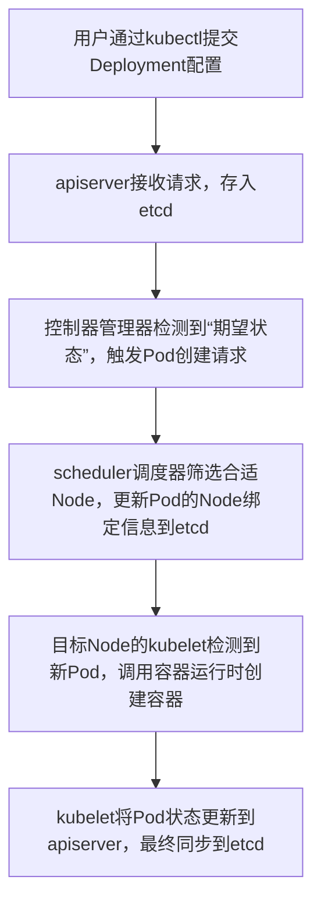

你需要的是K8s（Kubernetes）核心知识点总结，我会按「基础概念→核心组件→核心资源→核心流程→高频考点」的逻辑梳理，既适合面试记忆，也能快速掌握核心框架，每个知识点都用「一句话核心+补充说明」的形式，新手也能快速理解。

### 一、基础概念（先懂“是什么”）
| 知识点 | 核心定义 | 补充说明 |
|--------|----------|----------|
| K8s本质 | 开源的容器编排平台，自动化容器的部署、扩缩容、运维 | 核心目标：让容器化应用在集群中高效、稳定运行 |
| 集群架构 | 由**控制平面（Master）** + **节点（Node）** 组成 | 控制平面负责决策，节点负责执行；可单节点（测试）/多节点（生产） |
| 核心理念 | 声明式API：你定义“想要的状态”，K8s负责“实现并维持状态” | 对比命令式（手动一步一步操作），声明式更高效、可追溯 |

### 二、核心组件（集群的“五脏六腑”）
#### 1. 控制平面组件（Master节点）
| 组件 | 核心作用 | 面试高频考点 |
|------|----------|--------------|
| kube-apiserver | 所有操作的统一入口，提供REST API，是集群的“大脑网关” | 唯一能直接操作etcd的组件；可水平扩展提高并发 |
| etcd | 集群的“数据库”，存储所有集群状态、配置数据 | 分布式键值存储；需备份，数据丢失则集群崩溃 |
| kube-scheduler | 调度器，负责把Pod分配到合适的Node节点 | 调度策略：资源充足性、亲和性/反亲和性、污点/容忍度 |
| kube-controller-manager | 控制器集合（节点控制器、副本控制器等），维持集群“期望状态” | 核心功能：监控Pod状态，比如副本数不够时自动新建Pod |
| cloud-controller-manager | 对接云厂商API（如阿里云、AWS），管理云资源 | 非必选，仅混合云/公有云场景使用 |

#### 2. 节点组件（Node节点）
| 组件 | 核心作用 | 面试高频考点 |
|------|----------|--------------|
| kubelet | 节点的“管家”，监听apiserver，执行Pod的创建、启停等操作 | 仅管理本节点的Pod，不跨节点；检查容器健康状态 |
| kube-proxy | 节点的“网络代理”，维护Pod网络规则，实现Service访问 | 实现方式：iptables（默认）/IPVS（高性能场景） |
| 容器运行时 | 运行容器的底层引擎，如containerd、CRI-O | Docker已被弃用，现在主流是containerd（轻量、稳定） |

### 三、核心资源（日常操作的“核心对象”）
| 资源名称 | 核心作用 | 关键特性 |
|----------|----------|----------|
| Pod | K8s最小部署单元，包含一个/多个容器，共享网络/存储 | 不可直接修改（改配置需重建）；IP随Pod重建而变 |
| Service | 为Pod提供稳定的访问入口（固定IP/域名），实现Pod负载均衡 | 类型：ClusterIP（集群内访问）、NodePort（暴露到节点端口）、LoadBalancer（云厂商负载均衡）、Ingress（七层路由） |
| Deployment | 管理无状态应用，控制Pod副本数、滚动更新/回滚 | 最常用的控制器；支持扩缩容、版本管理 |
| StatefulSet | 管理有状态应用（如数据库），保证Pod名称/网络标识固定 | 有序部署/删除；配合PVC实现数据持久化 |
| ConfigMap | 存储非敏感配置（如配置文件、环境变量） | 可热更新；与Pod解耦，避免配置硬编码 |
| Secret | 存储敏感信息（密码、token、证书） | 数据默认base64编码（需加密增强安全性） |
| PersistentVolume(PV) | 集群级存储资源，抽象底层存储（本地盘、云盘） | 生命周期独立于Pod；支持多种存储类型（NFS、Ceph等） |
| PersistentVolumeClaim(PVC) |  Pod申请PV的“请求单”，按需绑定PV | 声明式存储，Pod无需关心底层存储实现 |
| Namespace | 集群资源隔离，划分不同环境（dev/test/prod） | 资源名仅在Namespace内唯一；可设置资源配额 |

### 四、核心流程（面试高频：“Pod创建流程”）

核心关键点：
1. 所有操作必须经过apiserver，无直接操作etcd/节点的情况；
2. scheduler只负责“选节点”，不负责“创建Pod”，创建由kubelet完成；
3. 全程是“状态驱动”：控制器不断对比“期望状态”和“实际状态”，直到一致。

### 五、高频考点/面试常问
1. **Pod与容器的区别**：Pod是K8s最小部署单元，可包含多个容器，共享网络/存储；容器是应用运行载体，Pod为容器提供运行环境。
2. **Deployment和StatefulSet的区别**：Deployment无状态，Pod名称随机、可随意替换；StatefulSet有状态，Pod名称固定、有序部署/删除，适合数据库等场景。
3. **Service的作用**：解决Pod IP不固定的问题，提供稳定访问入口，实现负载均衡；NodePort的端口范围默认30000-32767。
4. **Pod的健康检查**：livenessProbe（存活探针，检测容器是否运行，失败则重启）、readinessProbe（就绪探针，检测容器是否可提供服务，失败则剔除Service流量）、startupProbe（启动探针，等待应用启动完成）。
5. **污点（Taint）和容忍度（Toleration）**：污点给Node打标记，阻止普通Pod调度；容忍度给Pod配置，允许Pod调度到有对应污点的Node（如主节点设置污点，避免调度普通Pod）。

### 总结
1. K8s核心是**容器编排+声明式API**，控制平面做决策，节点做执行，etcd存状态；
2. 核心资源中，Pod是最小单元，Deployment管理无状态应用，Service提供稳定访问，PV/PVC实现持久化存储；
3. 面试高频：Pod创建流程、核心组件作用、Deployment/StatefulSet区别、Service类型、健康检查。

如果需要针对面试场景精简成「一页纸速记版」，或者补充「常用kubectl命令」「故障排查思路」，可以告诉我。