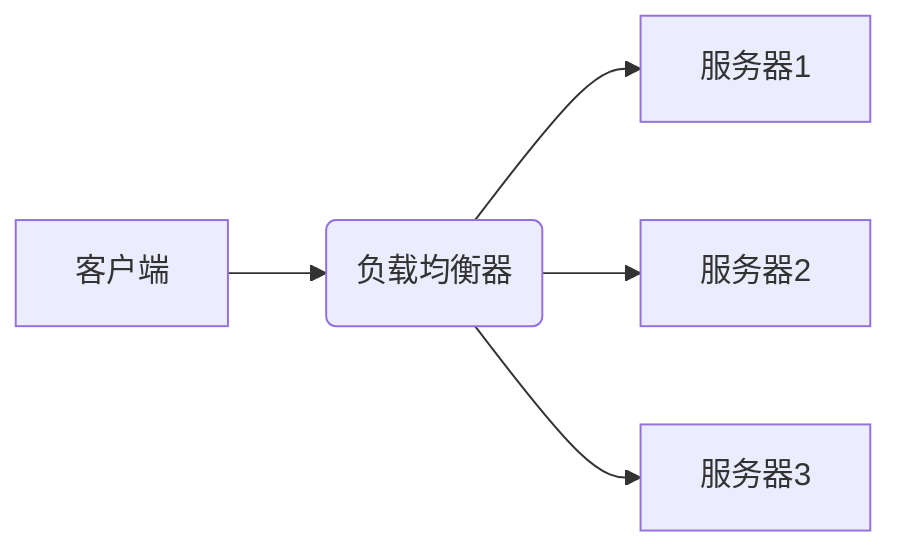

### 一、配置相关技巧（最常用，避坑+提效）
#### 1. 配置文件模块化拆分（避免单文件臃肿）
新手常把所有配置写在`nginx.conf`里，维护困难。建议按功能拆分：
```nginx
# 主配置 nginx.conf
http {
    include       mime.types;
    default_type  application/octet-stream;
    
    # 引入拆分的配置文件
    include /etc/nginx/conf.d/*.conf;  # 站点配置
    include /etc/nginx/conf.d/optimization.conf;  # 性能优化配置
    include /etc/nginx/conf.d/security.conf;  # 安全配置
}
```
- 拆分原则：按「站点（如blog.conf）、功能（如cache.conf）、环境（如prod.conf）」划分；
- 好处：修改单个站点配置无需动主文件，排查问题更高效。

#### 2. 配置语法校验+平滑重启（避免服务中断）
修改配置后千万别直接`service nginx restart`（会断连），正确流程：
```bash
# 1. 校验配置语法（核心！先验错再重启）
nginx -t

# 2. 平滑重启（不中断现有连接）
nginx -s reload

# 3. 强制停止/重新打开日志（排错用）
nginx -s stop
nginx -s reopen
```

#### 3. 常用变量快速定位问题
配置中加入变量打印，方便排查请求来源、路径等问题：
```nginx
server {
    listen 80;
    server_name example.com;
    
    # 日志中打印关键变量
    access_log  /var/log/nginx/example_access.log  main '$remote_addr $request_uri $status $request_time $http_user_agent';
    
    # 测试时直接返回变量值（临时用）
    location /test {
        return 200 "IP: $remote_addr | URI: $request_uri | Host: $host";
    }
}
```

### 二、性能调优技巧（提升并发+降低延迟）
#### 1. 调整worker进程数（适配CPU核心）
```nginx
# nginx.conf 顶层配置
worker_processes  auto;  # 自动适配CPU核心数（推荐）
# 或指定固定值（如4核CPU设4）：worker_processes 4;

worker_cpu_affinity 0001 0010 0100 1000;  # 绑定进程到CPU核心（多核优化）
worker_rlimit_nofile 65535;  # 提升进程最大打开文件数
```

#### 2. 连接数与超时优化（减少资源占用）
```nginx
http {
    keepalive_timeout 65;  # 长连接超时时间（默认75，建议65）
    keepalive_requests 10000;  # 单个长连接处理的最大请求数（默认100，调大）
    
    client_header_timeout 10s;  # 客户端请求头读取超时
    client_body_timeout 10s;    # 客户端请求体读取超时
    send_timeout 10s;           # 响应发送超时
    
    # 缓冲区优化（减少磁盘IO）
    client_body_buffer_size 16k;
    client_header_buffer_size 1k;
    large_client_header_buffers 4 4k;
}
```

#### 3. 开启gzip压缩（减少传输体积）
```nginx
http {
    gzip on;
    gzip_vary on;  # 告诉浏览器启用压缩
    gzip_min_length 1k;  # 小于1k的文件不压缩
    gzip_types text/plain text/css application/json application/javascript text/xml application/xml application/xml+rss text/javascript;  # 压缩的文件类型
    gzip_comp_level 6;  # 压缩级别（1-9，6性价比最高）
}
```

### 三、安全防护技巧（避免常见攻击）
#### 1. 限制IP访问（保护后台/敏感接口）
```nginx
location /admin {
    # 只允许指定IP访问
    allow 192.168.1.100;
    allow 10.0.0.0/8;  # 允许整个网段
    deny all;  # 拒绝其他所有IP
}
```

#### 2. 防爬虫/限制请求频率（抗CC攻击）
```nginx
http {
    # 定义限流规则：10秒内最多100个请求
    limit_req_zone $binary_remote_addr zone=limit:10m rate=10r/s;
    
    server {
        # 应用限流（burst允许突发请求，nodelay不延迟）
        location / {
            limit_req zone=limit burst=20 nodelay;
        }
    }
}
```

#### 3. 隐藏Nginx版本号（减少指纹识别）
```nginx
# nginx.conf 顶层配置
server_tokens off;  # 关闭版本号显示

# 验证：curl -I http://你的域名 ，响应头中不会显示nginx/版本号
```

### 四、故障排查技巧（快速定位问题）
#### 1. 开启调试日志（定位502/404等问题）
```nginx
http {
    # 调试级日志（临时开启，排查完改回warn）
    error_log  /var/log/nginx/error.log  debug;
}
```
- 常见错误对应：
  - 502：后端服务（如PHP/Node）挂了或端口不通；
  - 403：文件权限/SELinux限制/目录无index文件；
  - 404：路径配置错误/文件不存在；
  - 504：后端服务响应超时（调大`proxy_connect_timeout`）。

#### 2. 测试后端连通性（排查反向代理问题）
如果Nginx做反向代理报502，先在Nginx服务器上测试后端：
```bash
# 测试后端端口是否通
telnet 127.0.0.1 8080
# 或用curl测试
curl http://127.0.0.1:8080
```

### 总结
1. **配置层面**：模块化拆分配置+修改后先校验语法，再平滑重启，避免服务中断；
2. **性能层面**：适配CPU核心数、调优长连接参数、开启gzip压缩，提升并发和传输效率；
3. **安全/排障层面**：限制敏感IP访问、隐藏版本号，调试日志快速定位502/404等常见问题。

---

# Nginx 负载均衡机制（新手易懂版）
你想了解的 Nginx 负载均衡，核心是**把用户请求合理分配到多台后端服务器**，既提升服务并发能力，又能实现故障自动切换，是高可用架构的基础。

## 一、核心原理（先搞懂基础逻辑）
1. Nginx 作为**反向代理服务器**，接收所有客户端请求
2. 根据预设的**负载均衡策略**，把请求转发到后端的应用服务器集群（比如 Tomcat/Node.js/Java 服务）
3. 后端服务器处理完请求后，结果通过 Nginx 回传给客户端
4. 全程客户端只感知 Nginx 的存在，不知道后端有多少台服务器



## 二、常用负载均衡策略（重点）
Nginx 内置了多种分配规则，你可以根据业务场景选择：

### 1. 轮询（默认策略）
- **逻辑**：请求按顺序依次分配给后端服务器，最简单的策略
- **适用场景**：后端服务器配置、性能基本一致的情况
- **核心配置示例**：
```nginx
http {
    # 定义后端服务器集群（upstream 是固定关键字）
    upstream backend_server {
        server 192.168.1.101:8080;  # 服务器1
        server 192.168.1.102:8080;  # 服务器2
        server 192.168.1.103:8080;  # 服务器3
    }

    server {
        listen 80;
        server_name your_domain.com;

        location / {
            # 转发请求到后端集群
            proxy_pass http://backend_server;
            proxy_set_header Host $host;  # 传递主机头，后端能识别域名
            proxy_set_header X-Real-IP $remote_addr;  # 传递真实客户端IP
        }
    }
}
```

### 2. 加权轮询（weight）
- **逻辑**：给性能好的服务器分配更高权重，权重越高，接收的请求越多
- **适用场景**：后端服务器配置不一致（比如有的是8核16G，有的是4核8G）
- **核心配置示例**：
```nginx
upstream backend_server {
    server 192.168.1.101:8080 weight=5;  # 权重5，接收请求最多
    server 192.168.1.102:8080 weight=3;  # 权重3
    server 192.168.1.103:8080 weight=1;  # 权重1，接收请求最少
}
```
- 效果：每9个请求中，服务器1拿5个，服务器2拿3个，服务器3拿1个。

### 3. IP 哈希（ip_hash）
- **逻辑**：根据客户端 IP 地址计算哈希值，固定把同一IP的请求分配到同一台后端服务器
- **核心作用**：解决**会话保持**问题（比如用户登录态存在某台服务器，不会因请求转发到其他服务器导致登录失效）
- **核心配置示例**：
```nginx
upstream backend_server {
    ip_hash;  # 开启IP哈希策略
    server 192.168.1.101:8080;
    server 192.168.1.102:8080;
    server 192.168.1.103:8080 down;  # down 标记服务器下线，不分配请求
}
```

### 4. 最少连接（least_conn）
- **逻辑**：优先把请求分配给当前活跃连接数最少的后端服务器
- **适用场景**：请求处理时间长短不一（比如有的请求要查数据库，有的只查缓存），避免某台服务器被长请求占满
- **核心配置示例**：
```nginx
upstream backend_server {
    least_conn;  # 开启最少连接策略
    server 192.168.1.101:8080;
    server 192.168.1.102:8080;
    server 192.168.1.103:8080 backup;  # backup 标记备用服务器，主服务器都挂了才用
}
```

### 5. 额外优化：健康检查
Nginx 会自动检测后端服务器状态，失败的服务器会被暂时剔除，恢复后自动加回：
```nginx
upstream backend_server {
    server 192.168.1.101:8080 max_fails=3 fail_timeout=30s;
    # max_fails：3次请求失败判定为服务器不可用
    # fail_timeout：失败后30秒内不再分配请求，30秒后重试
}
```

## 三、配置生效步骤（实操关键）
1. 修改 Nginx 配置文件（通常在 `/etc/nginx/nginx.conf` 或 `/etc/nginx/conf.d/` 目录）
2. 检查配置语法是否正确：`nginx -t`
3. 平滑重启 Nginx（不中断现有请求）：`nginx -s reload`

## 四、高级扩展（了解即可）
除了内置策略，Nginx 还支持通过第三方模块实现更复杂的负载均衡：
- **fair**：按后端服务器响应时间分配（响应快的优先）
- **url_hash**：按请求URL的哈希值分配（相同URL请求到同一服务器，提升缓存命中率）

---

### 总结
1. Nginx 负载均衡核心是通过 `upstream` 定义后端集群，结合不同策略分配请求；
2. 基础策略优先选：轮询（默认）、加权轮询（配置不均）、IP哈希（需会话保持）、最少连接（请求耗时不均）；
3. 配置后需通过 `nginx -t` 检查语法，`nginx -s reload` 平滑重启生效。