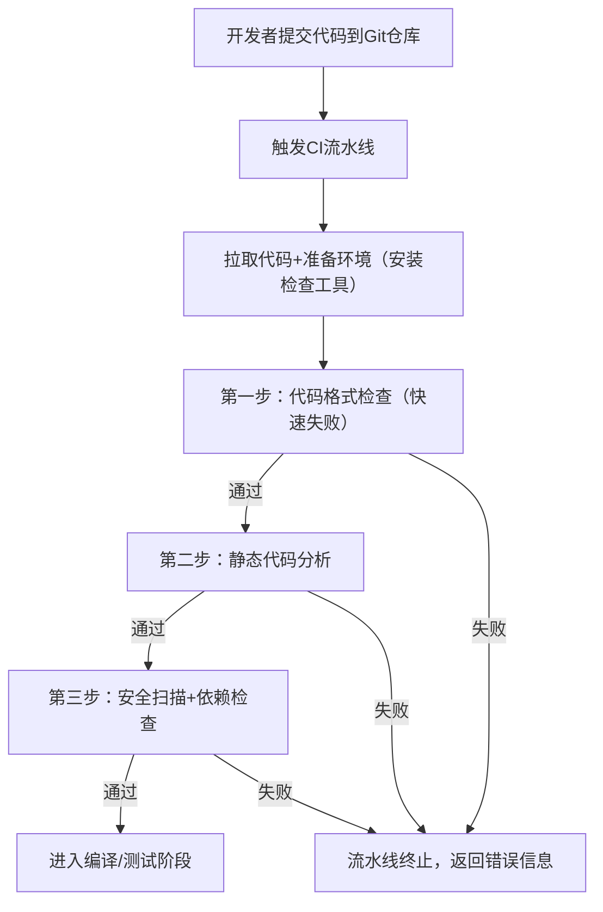

## 一、先搞懂：代码检查的核心类型
流水线中的代码检查不是单一环节，而是分层的自动化校验，主要分 4 类：

| 检查类型       | 检查目标                                  | 常用工具                          |
|----------------|-------------------------------------------|-----------------------------------|
| 代码格式/规范  | 缩进、命名、注释、代码风格统一            | ESLint（JS/TS）、Pylint（Python）、CheckStyle（Java）、Prettier（通用格式化） |
| 静态代码分析   | 语法错误、逻辑漏洞、未定义变量、空指针等  | SonarQube（多语言）、PMD（Java）、Flake8（Python）、Cppcheck（C++） |
| 安全扫描       | 敏感信息泄露、依赖漏洞、SQL注入、XSS等    | OWASP ZAP、Snyk、Trivy、Bandit（Python） |
| 代码复杂度/规范 | 圈复杂度、重复代码、不符合团队规范的写法  | SonarQube、CodeClimate            |

## 二、核心流程：流水线中代码检查的执行步骤
以最常用的 **GitLab CI/GitHub Actions** 为例，代码检查的通用流程如下：


### 关键细节：
1. **快速失败（Fast Fail）**：把最快的格式检查放在最前面，一旦失败立刻终止流水线，节省资源。
2. **结果反馈**：检查结果会直接显示在 Git 平台（如 GitHub/GitLab 的 PR 页面），标注具体错误行和修复建议。
3. **阈值控制**：可设置「阻断规则」（如：高危安全漏洞必须修复才能通过，低危警告可放行）。

## 三、实操案例：GitHub Actions 集成代码检查（Python 项目）
下面是一个可直接复制的流水线配置文件，包含 **Pylint（格式/静态分析）+ Bandit（安全扫描）**：

### 1. 项目根目录创建配置文件
路径：`.github/workflows/code-check.yml`

```yaml
name: 代码检查流水线
on: [push, pull_request]  # 代码推送/PR时触发

jobs:
  code-check:
    runs-on: ubuntu-latest
    steps:
      # 步骤1：拉取代码到CI服务器
      - name: 拉取代码
        uses: actions/checkout@v4

      # 步骤2：安装Python环境
      - name: 设置Python
        uses: actions/setup-python@v5
        with:
          python-version: '3.10'

      # 步骤3：安装检查工具
      - name: 安装依赖和检查工具
        run: |
          python -m pip install --upgrade pip
          pip install pylint bandit  # 安装Pylint和Bandit

      # 步骤4：代码格式/静态分析（Pylint）
      - name: Pylint代码检查
        run: |
          pylint --disable=R,C $(git ls-files '*.py')  # 禁用低优先级的R(重构)、C(规范)警告，只检查错误
        continue-on-error: false  # 检查失败则终止流水线

      # 步骤5：安全扫描（Bandit）
      - name: Bandit安全检查
        run: |
          bandit -r . -f json -o bandit-report.json  # 扫描所有Python文件，输出JSON报告
        continue-on-error: false

      # 步骤6：上传报告（可选，方便查看）
      - name: 上传安全扫描报告
        uses: actions/upload-artifact@v4
        with:
          name: bandit-report
          path: bandit-report.json
```

### 2. 关键代码解释
- `on: [push, pull_request]`：触发条件——开发者推送代码或提交PR时自动执行检查。
- `pylint --disable=R,C`：新手可先禁用低优先级警告，只关注致命错误（如语法错误、未定义变量），避免被大量规范警告劝退。
- `bandit -r .`：递归扫描当前目录所有Python文件，重点检查：硬编码密码、SQL注入、命令注入等安全问题。
- `continue-on-error: false`：检查失败则流水线直接终止，阻止代码进入后续编译/部署环节。

## 四、进阶：集成 SonarQube（一站式代码质量平台）
如果需要更全面的检查（复杂度、重复代码、历史问题追踪），可集成 SonarQube，步骤如下：

### 1. 先部署 SonarQube（Docker 快速部署）
```bash
# 启动SonarQube容器
docker run -d --name sonarqube -p 9000:9000 sonarqube:latest
# 访问 http://localhost:9000，默认账号密码：admin/admin
```

### 2. 修改流水线配置（添加 SonarQube 扫描）
在上述 GitHub Actions 配置中，新增步骤：
```yaml
# 步骤6：SonarQube 扫描
- name: SonarQube 代码分析
  env:
    SONAR_TOKEN: ${{ secrets.SONAR_TOKEN }}  # 在GitHub仓库设置SonarQube的token
    SONAR_HOST_URL: http://your-sonarqube-ip:9000
  run: |
    pip install sonar-scanner
    sonar-scanner \
      -Dsonar.projectKey=my-python-project \
      -Dsonar.sources=. \
      -Dsonar.host.url=$SONAR_HOST_URL \
      -Dsonar.login=$SONAR_TOKEN
```

## 五、新手避坑要点
1. **不要过度检查**：初期只关注「致命错误+高危安全漏洞」，避免大量规范警告导致开发抵触。
2. **本地预检查**：建议开发者本地配置相同的检查工具（如 VS Code 安装 ESLint 插件），先本地修复，减少流水线失败次数。
3. **增量检查**：只检查本次提交的代码（而非全量代码），提升流水线速度（SonarQube 支持增量扫描）。

---

### 总结
1. CI/CD 中的代码检查是**分层自动化执行**的，优先做快速的格式检查，再做静态分析和安全扫描，失败则终止流水线。
2. 核心工具按语言选择（如 Python 用 Pylint+Bandit，Java 用 CheckStyle+SonarQube），可直接集成到 GitHub Actions/GitLab CI。
3. 关键原则：**快速失败、阈值控制、本地预检查**，既保障质量，又不影响开发效率。

如果需要针对你的技术栈（如 Java/JS/Go）写专属的代码检查流水线配置，我可以直接给出可运行的文件。